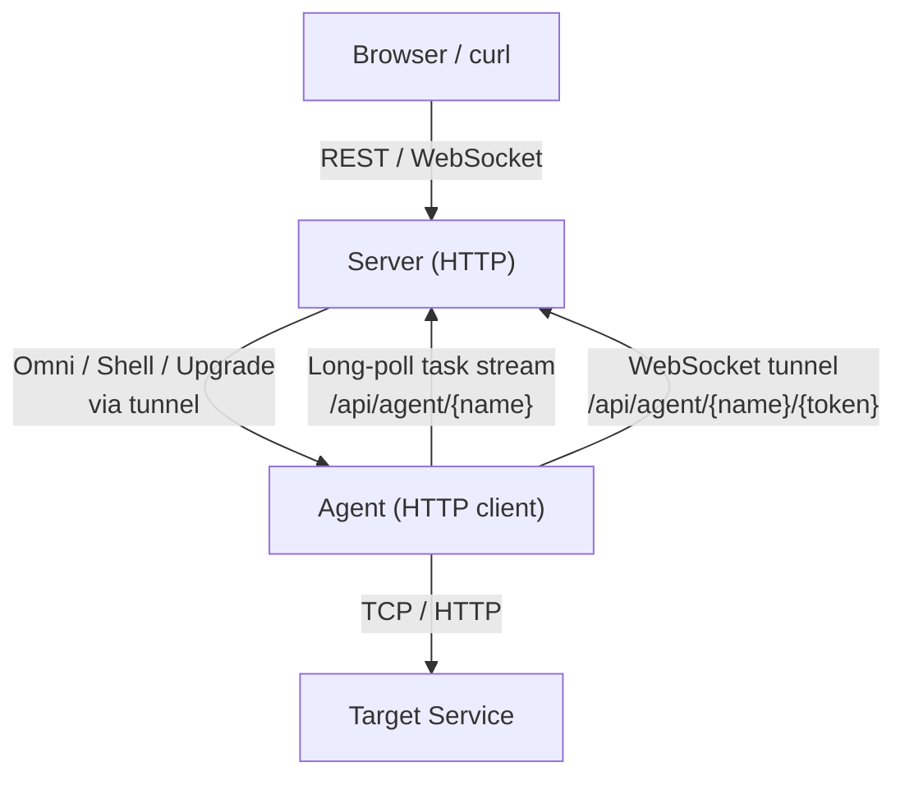

# Development Guide

## Architecture



Server distinguishes agent vs client traffic by `User-Agent` header:
- Agent: `go-remote-agent/...` (or empty) → `mux_agent`
- All others → `mux_client` or proxy dispatch

## Directory Structure

```
main.go                     # entry: delegates to agent.RunAgent or server.RunServer
biz/
  config.go                 # CLI flags + YAML config parsing
  protocol.go               # msgpack message types (AgentNotify, ProxyHttpRequest, …)
  protocol_gen.go           # auto-generated msgpack serialization (do not edit)
  version.go                # build version, upgrade compatibility check
agent/
  main.go                   # task stream listener + dispatcher
  shell.go                  # shell command execution over WebSocket
  agent_common/             # shared HTTP client / WebSocket dialer helpers
  agent_omni/
    main.go                 # omni session entry; handler dispatch table [256]func
    pty.go                  # PTY allocation (creack/pty)
    file.go                 # chunked file read/write
    proxy.go                # TCP / HTTP / WebSocket proxying
  agent_upgrade/
    main.go                 # binary self-upgrade
server/
  main.go                   # HTTP mux setup, proxy host routing
  agent_handler/
    store.go                # Agent / AgentInstance registry (sync.Map)
    agent_tunnel.go         # AgentTunnel — bidirectional channel pair per session
    handle_task_stream.go   # GET /api/agent/{name} — pushes tasks to agent
    handle_agent_tunnel.go  # GET /api/agent/{name}/{token} — WebSocket upgrade
  client_handler/           # REST handlers for /api/agent/, /api/proxy/, /api/saveConfig
  proxy/
    handler.go              # routes proxy requests by Host header
    service.go              # Service — lazy connection pool per proxy entry
    connectionToAgent.go    # ConnectionToAgent — multiplexed HTTP proxy over omni session
  assets/                   # embedded frontend (built from frontend-src/)
utils/
  chanutil.go               # RWChan (WebSocket ↔ channel), ReadChanUnderContext
frontend-src/               # Vue 3 + TypeScript source
```

## Local Development

### Prerequisites

- Go 1.23+
- Node.js + pnpm (for frontend)

### Setup

```sh
# minimal config.yaml for local testing
cat > config.yaml <<'EOF'
name: bot1
base_url: http://localhost:8080
EOF
```

Open three terminals:

```sh
# Terminal 1 — server
go run main.go

# Terminal 2 — agent
go run main.go -a

# Terminal 3 — send test commands
curl http://127.0.0.1:8080/api/agent/bot1/exec/ -F "cmd=uname -a" -F stderr=1
curl http://127.0.0.1:8080/api/agent/bot1/exec/ -F "cmd=wc -c" -F stdin=@main.go -F stdout=1
```

### Build Frontend

```sh
cd frontend-src
pnpm install
pnpm build        # outputs to server/assets/
```

### Regenerate msgpack Code

After editing `biz/protocol.go`:

```sh
~/go/bin/msgp -file biz/protocol.go
```

This regenerates `biz/protocol_gen.go`. Commit both files together.

### Deploy

`deploy.sh` builds a Linux amd64 binary and deploys via SSH + tmux:

```sh
bash deploy.sh
```

Edit the script to match your server hostname and tmux session name.

## Agent–Server Communication Protocol

### Task Stream (`GET /api/agent/{name}`)

Binary chunked HTTP response. Each frame:

```
[uint32 length LE] [msgpack AgentNotify] [0x0d 0x0a]
```

`AgentNotify.Type` values: `ping`, `shell`, `pty` (omni), `upgrade`.

### Tunnel WebSocket (`GET /api/agent/{name}/{token}`)

Agent connects after receiving an `AgentNotify` with a `token`. The server upgrades to WebSocket and pairs the connection with the waiting `AgentTunnel`.

## Shell Session Protocol

Over tunnel WebSocket:

**Server → Agent:**
- `0x00 <data>` — write stdin
- `0x01` — close stdin
- `0x02 <int32 signal>` — send signal

**Agent → Server:**
- `0x00 <int32 exit_code>` — process exited
- `0x01 <data>` — stdout
- `0x02 <data>` — stderr
- `0x03 <message>` — debug

## Omni Session Protocol

Over tunnel WebSocket (also used directly by `/api/agent/{name}/omni/`).

### Common

| Dir | Byte | Payload | Description |
|-----|------|---------|-------------|
| S→A | `0xff` | `<str>` | Ping (agent echoes back) |
| A→S | `0xff` | `<str>` | Debug message |

### PTY

| Dir | Byte | Payload | Description |
|-----|------|---------|-------------|
| S→A | `0x00` | `<data>` | PTY input |
| S→A | `0x01` | `[msgpack StartPtyRequest]` | Start PTY (`cmd`, `args`, `env`, `no_inherit_env`) |
| S→A | `0x02` | — | Close PTY |
| S→A | `0x03` | `<u16 cols> <u16 rows> <u16 w> <u16 h>` | Resize |
| A→S | `0x00` | `<data>` | PTY output |
| A→S | `0x01` | — | PTY opened |
| A→S | `0x02` | — | PTY closed |

### File Transfer

| Dir | Byte | Payload | Description |
|-----|------|---------|-------------|
| S→A | `0x10` | `<u64 offset> <u64 length> <path> <data>` | Write chunk (empty data = truncate to offset) |
| S→A | `0x11` | `<path>` | Query file info |
| S→A | `0x12` | `<u64 offset> <u64 length> <path>` | Request read chunk |
| A→S | `0x10` | `<u64 offset> <path>` | Write acknowledged |
| A→S | `0x11` | `<msgpack FileInfo>` | File info response |
| A→S | `0x12` | `<u64 offset> <u64 length> <path> <data>` | Read chunk |

### TCP / HTTP Proxy

| Dir | Byte | Payload | Description |
|-----|------|---------|-------------|
| S→A | `0x20` | `<u32 id> <u16 port> <addr>` | Open TCP channel |
| S→A | `0x21` | `<u32 id> <data>` | Send data |
| S→A | `0x22` | `<u32 id>` | Close channel |
| S→A | `0x23` | `<u32 id> <msgpack ProxyHttpRequest>` | HTTP request |
| A→S | `0x20` | `<u32 id> <u8 code> <errmsg>` | Dial result (0 = ok) |
| A→S | `0x21` | `<u32 id> <data>` | Data / WS frame (`[u8 msgType] <data>` for WS) |
| A→S | `0x22` | `<u32 id>` | Channel closed |
| A→S | `0x23` | `<u32 id> <msgpack ProxyHttpResponse>` | HTTP response headers |

WebSocket `0x21` data format: `[u8 messageType] <payload>` where messageType follows RFC 6455 opcodes (0x01 text, 0x02 binary, 0x09 ping, 0x0a pong).

## Agent Upgrade Protocol

Over tunnel WebSocket. At any step, agent may send `0x99 <error>` to abort.

1. S→A: `0x00` — can you upgrade?
2. A→S: `0x00 <executable_path>` — yes, here's my path
3. S→A: `0x01 <i64 total_size>` — incoming binary
4. (repeat) S→A: `0x02 <i64 offset> <chunk>` / A→S: `0x00 <i64 new_offset>` — binary chunks
5. A→S: `0x01` — file renamed
6. A→S: `0x02` — new process started

## Known Issues

The issues below were identified and fixed. The one remaining open item requires a protocol change.

### Open

**Large request body fully buffered** (`server/proxy/service.go`)

HTTP request bodies are read entirely into memory before proxying. Fixing this requires streaming the body through the agent tunnel, which is a protocol-level change (the current `ProxyHttpRequest` msgpack struct carries `Body []byte`).
