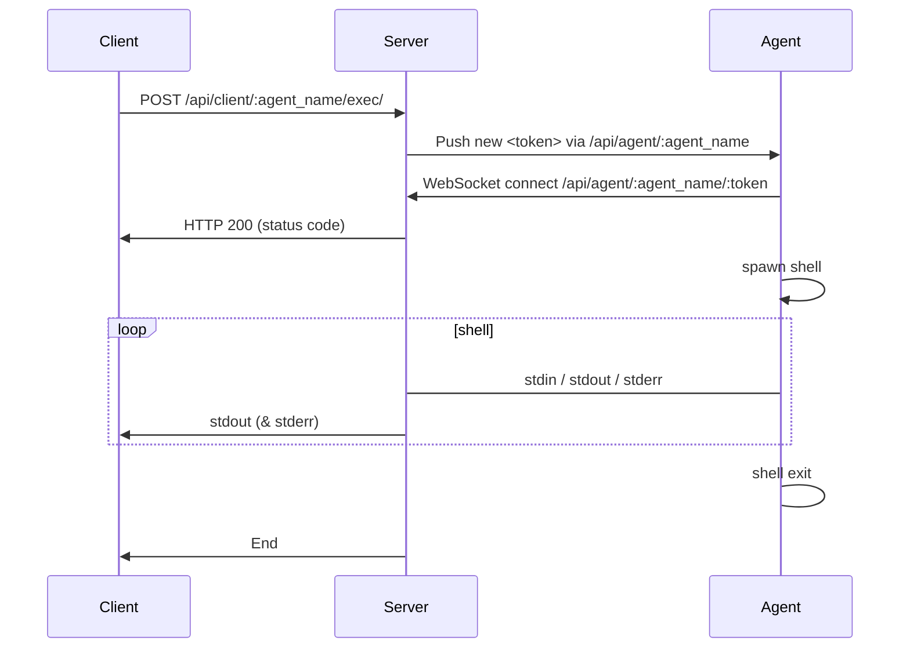

# Remote Agent


This is a program that can act as a server or a agent.

When act as a `Server`. It starts a HTTP server that accepts connections from agents and client API requests. 
You may treat it as a broker.

When act as an `Agent`, it connects to server, wait for shell commands, run, upload results. It may run on a remote machine, and be controlled by a client.
It auto-reconnects to server. Agent doesn't need a public IP.

## Usage

```sh
export GOARCH=amd64 GOOS=linux
go build -o agent_linux_amd64 main.go
go build -ldflags "-s -w" -o agent_linux_amd64 main.go
```

Then run it:

```sh
# run as a server
./agent_linux_amd64 

# run as an agent
./agent_linux_amd64 -a -n bot1 -b http://127.0.0.1:8080

# send command to agent
curl http://127.0.0.1:8080/api/client/bot1/exec/ -F "cmd=ffmpeg -codecs" -F stderr=1
curl http://127.0.0.1:8080/api/client/bot1/exec/ -F "cmd=wc -c" -F stdin=@file.bin 
```

## API

### GET /api/agent/:agent_name

For agent.

This is a binary stream. When a client want to run a command, the server will push the command to the agent.

Each package starts with a `uint32` of length (in LittleEndian), then the data of `AgentNotify` (encoded by `msgp`), then a CRLF (`0x0d 0x0a`).

### GET /api/agent/:agent_name/:token

For agent.

This is a WebSocket connection.

#### shell session

S->A:

- `0x00 <data>` - write stdin
- `0x01` - close stdin
- `0x02 <int32_signal>` - send signal

A->S

- `0x00 <int32_code>` - exit code
- `0x01 <data>` - stdout
- `0x02 <data>` - stderr
- `0x03 <error_msg>` - debug message

### POST /api/client/:agent_name/exec/

For client.

Run a command on the agent. The payload is a FormData:

- `cmd`: string, command to run. will be passed as `sh -c <cmd>`
- `stdin`: (optional) file
- `stdout`: (optional) set to `0` to disable stdout (default enabled)
- `stderr`: (optional) set to `1` to enable stderr
- `full`: (optional) set to `1` to recv all raw data:
  - `<uint32 length> <package>` where `<package>` is same as A->S above, length is littleEndian
  - meanwhile, `stdout` and `stderr` will be disabled

It streams the response to the client.

Note: check status must be 200, otherwise the body is error message.

## How WebSocket works


